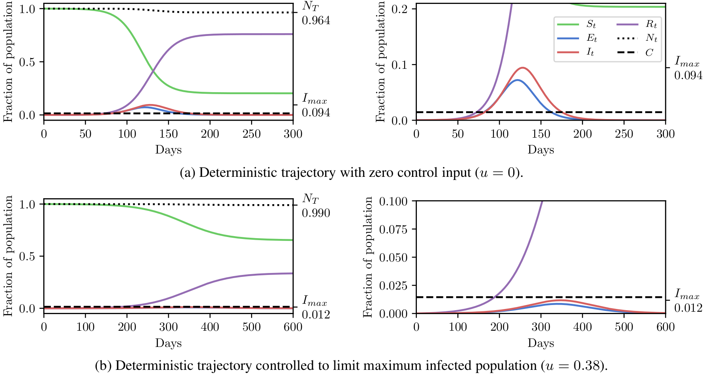
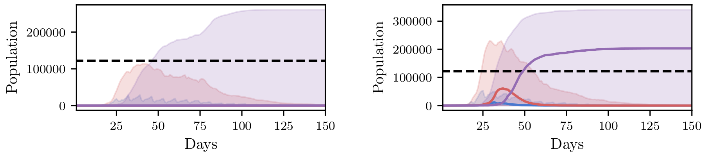

# Planning as Inference in Epidemiological Dynamics Models
Source code for the paper *Planning as Inference in Epidemiological Dynamics Models*.

# TL;DR
In this work we demonstrate how existing software tools can be used to automate parts of infectious disease-control policy-making via performing inference in existing epidemiological dynamics models.  The kind of inference tasks undertaken include computing, for planning purposes, the  posterior distribution over putatively controllable, via direct policy-making choices, simulation model parameters that give rise to acceptable disease progression outcomes.  Neither the full capabilities of such inference automation software tools nor their utility for planning is widely disseminated at the current time.  Timely gains in understanding about these tools and how they can be used may lead to more fine-grained and less economically damaging policy prescriptions, particularly during the current COVID-19 pandemic.

<strong>Policy goal</strong>: we aim to maintain the maximal infectious population below a certain number computed according to the required number of hospital beds per capita.

# Experiments
The experiments and running them are explained in detail in their own readme. They are just briefly described here.

## [SEIR](SEIR/)
SEIR (Susceptible-Exposed-Infectious-Recovered) models are a class of compartmental models in epidemiology. In such models, the population is subdivided into a set of compartments, representing the susceptible (uninfected), exposed (infected but not yet infectious), infectious (able to infect/expose others) and recovered (unable to be infected). All the individuals within a compartment is treated identically.

Our experiment is on a SEI3R variant where we infer the parameters of this model conditioned on the policy goal.

    
     
    Populations per compartment during deterministic SEI3R simulations, both without intervention (top) and with intervention (bottom). Plots in the left column show the full state trajectory, and in the right column are cropped to more clearly show the exposed and infected populations. Without intervention, the infected population greatly exceeds the limit (0.0145, black dashed line) for a period, overwhelming hospital capacities. With intervention, the infected population always remains below this limit.

<!---->

    
     
    Stochastic SEI3R in a model predictive control setting. At each step, our method solves for the minimum required control such that the constraint is satisfied. We plot the 90% confidence interval over trajectories conditioned on this control value. We then step through the system, randomly sampling continuations, and adapting the controls used such that the constraint is always met. We uncover that the amount of control required reduces over time as herd immunity comes into effect. (red) Infected, (blue) Exposed (purple) Recovered.

## [FRED](FRED/)
[FRED](https://fred.publichealth.pitt.edu/) (A Framework for Reconstructing Epidemiological Dynamics) is an open source agent-based simulator for epidemiological dynamics. FRED captures demographic and geographic heterogeneities of the population by modelling every individual in a region, including realistic households, workplaces and social networks. Using census-based models available for every state and county in the US and selected international locations, FRED simulates interactions within the population in discrete time steps of one day.

We couple FRED with [pyprob](https://github.com/pyprob/pyprob), a probabilistic programming library capable of performing cross-platform inference. It enables us to do solve the policy-making problem with fine grained policy choices.

<!---->

    
     
    Array of 2D histograms showing two-dimensional marginal distributions over controllable policy parameters that give rise to appropriately controlled outcomes in Allegheny county. Marginals for each policy are shown in the bottom row, with the number of samples from the uniform prior indicated by the dashed line. We can clearly see the efficacy of high rates of hand washing and a quick school closure policy, as indicated by the non-uniformity of the marginal distributions.

    
     
     SEIR statistics extracted from a FRED simulation of an *influenza* (not COVID-19) outbreak in Allegheny County. (left) controlled scenarios keeping the number of infectious people below 10% (black dotted line), and (right) uncontrolled scenarios. We plot the median and confidence bands between 3rd and 97th percentile. On the left the confidence interval for infectious people (red) stays below our constraint, verifying that all controlled runs follow our policy, while the confidence band for the uncontrolled scenarios violates our policy constraint.

    
     
     Progression of a simulated influenza epidemic in Allegheny county under controlled (left) and uncontrolled (right) scenarios. Each red dot represents a household with at least one infected resident. We see a control policy focusing on hygiene, rapid school closures, and isolation of symptomatics ``flattens the curve'' by slowing the onset of the virus.

## Publication
### Citation