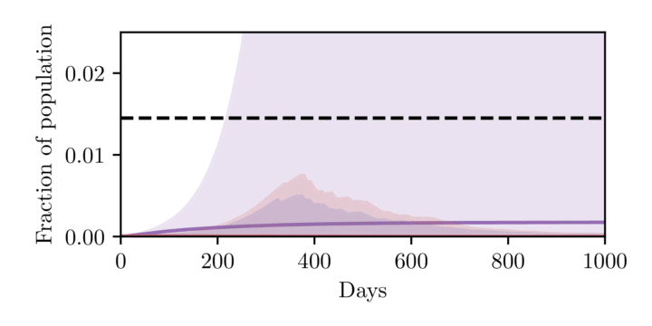
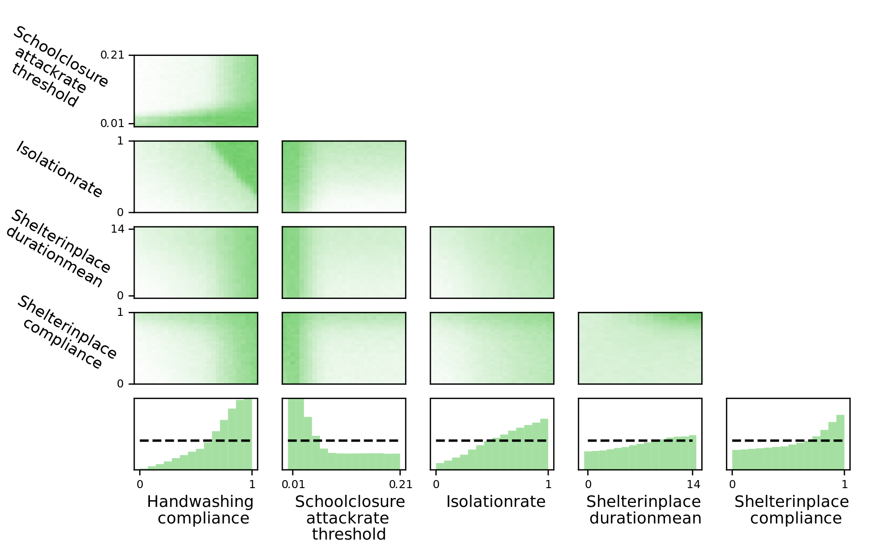

# Planning as Inference in Epidemiological Dynamics Models
Source code for the paper *Planning as Inference in Epidemiological Dynamics Models*.

# Abstract
In this work we demonstrate how existing software tools can be used to automate parts of infectious disease-control policy-making via performing inference in existing epidemiological dynamics models.  The kind of inference tasks undertaken include computing, for planning purposes, the  posterior distribution over putatively controllable, via direct policy-making choices, simulation model parameters that give rise to acceptable disease progression outcomes.  Neither the full capabilities of such inference automation software tools nor their utility for planning is widely disseminated at the current time.  Timely gains in understanding about these tools and how they can be used may lead to more fine-grained and less economically damaging policy prescriptions, particularly during the current COVID-19 pandemic.

# Experiments
The experiments and running them are explained in detail in their own readme. They are just briefly described here.

## [SEIR](SEIR/)
SEIR (Susceptible-Exposed-Infectious-Recovered) models are a class of compartmental models in epidemiology. In such models, the population is subdivided into a set of compartments, representing the susceptible (uninfected), exposed (infected but not yet infectious), infectious (able to infect/expose others) and recovered (unable to be infected). All the individuals within a compartment is treated identically.

Our experiment is on a SEI3R variant.

<!---->

    
     
    <small>Stochastic SEI3R in a model predictive control setting. At each step, our method solves for the minimum required control such that the constraint is satisfied. We plot the 90% confidence interval over trajectories conditioned on this control value. We then step through the system, randomly sampling continuations, and adapting the controls used such that the constraint is always met. We uncover that the amount of control required reduces over time as herd immunity comes into effect. (red) Infected, (blue) Exposed (purple) Recovered.</small>

## [FRED](FRED/)
FRED (A Framework for Reconstructing Epidemiological Dynamics) is an open source agent-based simulator for epidemiological dynamics. It simulates each person separately with its own properties. The spread of a disease with its own user-defined parameters is then simulated through interaction of the simulated people.

<!---->

    
     
    <small>Array of 2D histograms showing two-dimensional marginal distributions over controllable policy parameters that give rise to appropriately controlled outcomes in Allegheny county. Marginals for each policy are shown in the bottom row, with the number of samples from the uniform prior indicated by the dashed line. We can clearly see the efficacy of high rates of hand washing and a quick school closure policy, as indicated by the non-uniformity of the marginal distributions.</small>

## Publication