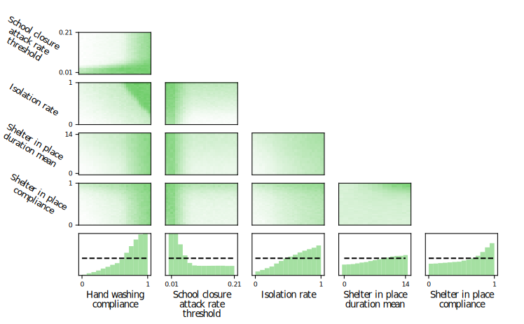

# Planning as Inference in Epidemiological Dynamics Models
Source code for the paper *Planning as Inference in Epidemiological Dynamics Models*.

# Abstract
In this work we demonstrate how existing software tools can be used to automate parts of infectious disease-control policy-making via performing inference in existing epidemiological dynamics models.  The kind of inference tasks undertaken include computing, for planning purposes, the  posterior distribution over putatively controllable, via direct policy-making choices, simulation model parameters that give rise to acceptable disease progression outcomes.  Neither the full capabilities of such inference automation software tools nor their utility for planning is widely disseminated at the current time.  Timely gains in understanding about these tools and how they can be used may lead to more fine-grained and less economically damaging policy prescriptions, particularly during the current COVID-19 pandemic.

# Experiments
The experiments and running them are explained in detail in their own readme. They are just briefly described here.

## [SEIR](SEIR/)
SEIR (Susceptible-Exposed-Infectious-Recovered) models are a class of compartmental models in epidemiology. Our experiment is on a SEI3R variant.

## [FRED](FRED/)
FRED (A Framework for Reconstructing Epidemiological Dynamics) is an open source agent-based simulator for epidemiological dynamics. It simulates each person separately with its own properties. The spread of a disease with its own user-defined parameters is then simulated through interaction of the simulated people.

## Publication